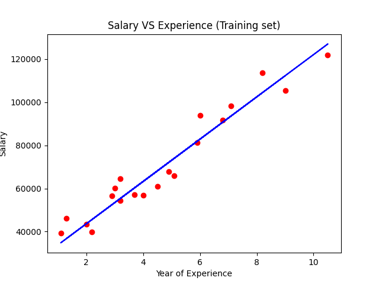
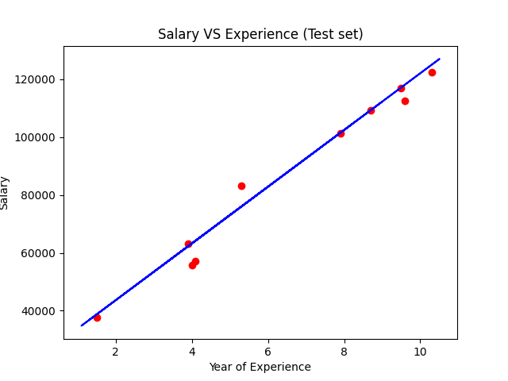

# Linear Regression

Just like Naive Bayes is a good starting point for classification tasks, linear regression models are a good starting point for regression tasks. It is a machine learning algorithm based on supervised learning. It models a target prediction value based on independent varaibles. It is mostly used for finding out the relationship between variables and forecasting. Linear regression perform the task to predict a dependent variable value $y$ based on a given independent variable $x$. Hypothesis function for Linear Regression:

```math
y = \theta_{1} + \theta_{2} x
```

where $x$ is input training data and $y$ is the label to the data.

When training the model, it fits the best line to predict the value of $y$ for a given value of $x$. The model gets the best regression fit line by finding intercept $\theta_{1}$ and coefficient (slope) of $x$, $\theta_{2}$. 

By achieving the best fit regression line, the model aims to predict $y$ value such that the error difference between predicted value and true value is minimum. So, it is very important to update the $\theta_{1}$ and $\theta_{2}$ values, to reach the best value that minimize the error between predicted $y$, $pred$ and true $y$.

```math
\mathcal{J} = \frac{1}{n} \sum_{i=1}^{n} (pred_{i} - y_{i})^{2}
```

Cost function $\mathcal{J}$ of Linear Regression is Root Mean Square Error (RMSE) between predicted $y$ and true $y$.

To update $\theta_{1}$ and $\theta_{2}$ values in order to reduce cost function (minimizing RMSE) and achieving the best fit line the model uses Gradient Descent. The idea is to start with random $\theta_{1}$ and $\theta_{2}$ values and then iteratively updating the values, reaching minimum cost. 

We update $\theta_{1}$ and $\theta_{2}$ as follow:

```math
\theta_{1} = \theta_{1} - \alpha \cdot \partial \theta_{1}
```

```math
\theta_{2} = \theta_{2} - \alpha \cdot \partial \theta_{2}
```

where $\partial \theta_{1} = \frac{\partial \mathcal{J}(\theta_{1},\theta_{2})}{\partial \theta_{1}} = \frac{2}{n} \sum_{i=1}^{n} (pred_{i} - y_{i})$, $\partial \theta_{2} = \frac{\partial \mathcal{J}(\theta_{1},\theta_{2})}{\partial \theta_{2}} = \frac{2}{n} \sum_{i=1}^{n} (pred_{i} - y_{i}) \cdot x_{i}$ and $\alpha$ is the learning rate.


## Implementation

With above math implemented, a simple dataset with salary vs. year of experience was tested.

| Train | Test |
|:--------------:|:-----------:|
|||