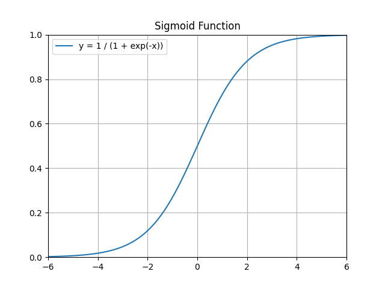

# Logistic Regression

Logistic Regression is the most widely used machine learning algorithm for classification problem. In its original form, it is used for binary classification problem.

## Sigmoid Function

A sigmoid function is a mathematical function having a characteristic "s"-shaped curve. Mathematically,

$$
\sigma(z) = \frac{1}{1 + e^{-z}} = \frac{e^{z}}{1 + e^{z}}
$$

Sigmoid function gives us the probability of being into class 1 or class 0. So, generaly we take the threshold as 0.5 and say if $P \geq 0.5$, then it belongs to class 1 and if $P \leq 0.5$, then it belongs to class 0.

In comparison to linear regression where we minimize sum of squared errors (SSE) i.e. 

$$
SSE = \sum (y_{i} - {\hat{y}}_{i})^{2}
$$

we maximize log-likelihood instead. The main reason behind this is that SSE is not a convex function hence finding a single minima would not be easy, there could be more than one minima. However, log-likelihood is a convex function and hence finding optimal parameters is easier.

$$
\text{log-likelihood} = \sum y log \hat{y} + (1 - y) log (1 - \hat{y})
$$ 

#### Formulation oof logistic regression

Given $x, y$, we want $\hat{y} = P(y = 1 | x)$, where $x \in \mathbb{R}^{n_{x}}, y \in \mathbb{R}$. The implementation is inspired by neural network, hence we will use parameters $w \in \mathbb{R}^{n_{x}}, b \in \mathbb{R}$ ($w$ and $b$ are considered weight and bias in neural network) with a sigmoid function i.e. $\hat{y} = \sigma(w^{T}x+b)$.

As discussed above, we will use log-likelihood as loss (error) function.

$$
\mathcal{L}(\hat{y} - y) = -\[ y log \hat{y} + (1 - y) log (1 - \hat{y}) \]
$$

Here, if $y = 1 \rightarrow \mathcal{L}(\hat{y} - y) = -log \hat{y}$, we want $log \hat{y}$ to be large which imply $\hat{y}$ should be large and by sigmoid function, $\hat{y} \approx 1$. Also, if $y = 0 \rightarrow \mathcal{L}(\hat{y} - y) = -log (1- \hat{y})$, we want $(1- log \hat{y})$ to be large which imply $\hat{y}$ should be small and by sigmoid function, $\hat{y} \approx 0$. This is another reason why we use log-likelihood instead of SSD. Similarly, we have cost function as 

$$
\mathcal{J}(w,b) = - \frac{{1}{m} \sum_{i=1}^{m} \[ y_{i} log \hat{y}_{i} + (1 - y_{i}) log (1 - \hat{y}_{i}) \]
$$

We want to find $w, b$ such that $\mathcal{J}(w,b)$ is minimized. So we use gradient descent algorithm with learning rate $\alpha$ to update $w,b$ iteratively.

$$
w := w - \alpha \frac{\partial \mathcal{J}(w,b)}{\partial w}
$$

$$
b := b - \alpha \frac{\partial \mathcal{J}(w,b)}{\partial b}
$$
