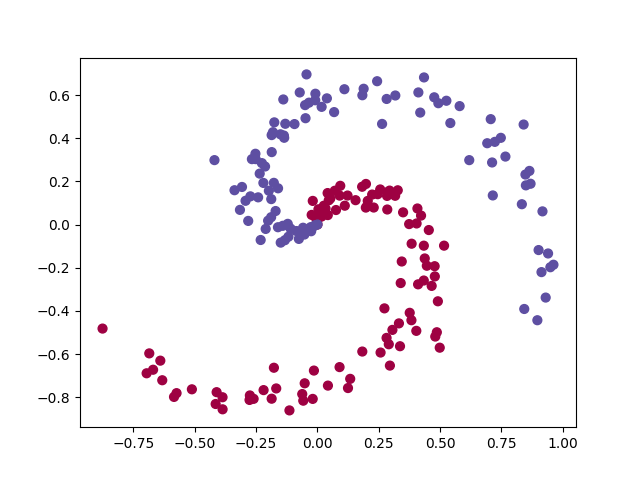
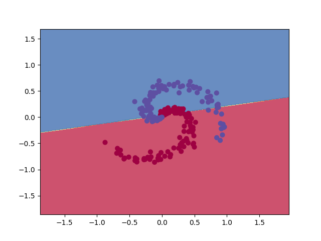
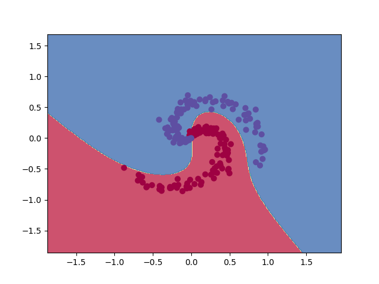

# Support Vector Machines (SVM)

SVM are powerful yet flexible supervised machine learning algorithms which are used both for classification and regression. But generally, they are used in classification problem. They are popular because of their ability to handle multiple continuous and categorical variables.

An SVM model is basically a representation of different classes in a hyperplane in multidimensional space. The hyperplane will be generated in an iterative manner by SVM so that error can be minimized. The goal of SVM is to divide the datasets into classes to mind a minimum marginal hyperplane.

Some important concepts in SVM:

1. Support vectors

Datapoints that are closest to the hyperplane is called support vectors. Separating line will be defined with the help of these data points.

2. Hyperplane

It is a decision plane or space which is divided between a set of objects having different classes.

3. Margin

It may be defined as the gap between two lines on the closest data point of different classes. It can be calculated as the perpendicular distance from the line to the support vectors. Large margin is considered as a good margin while small margin is considered as a bad margin.

The main goal of SVM is to divide the dataset into classes to find a maximum marginal hyperplane as follow:

- First, SVM will generate hyperplanes iteratively that segregates the classes in best way.

- Then, it will choose the hyperplane that separate the classes correctly.

Building an optimized hyperplane in a non linearly separable problem is done using kernels. The kernels are mathematically functions that convert the complex problem using the linear algebric form.

Assume we have $n$ training points, each observation $i$ has $p$ features (i.e. $x_{i}$ has $p$ dimensions), and is in two classes $y_{i}=-1$ or $y_{i} = 1$. We can draw a hyperplane through our feature space such that all instances of one class are on one side of the hyperplane, and all instances of the other class are on the opposite side. 

A hyperplane in $p$ dimensions is a $p-1$ dimensional subspace. In the two-dimensional example that follows, a hyperplane is just a line. We define a hyperplane as:

$$
x * \tilde{w} + \tilde{b} = 0
$$

where $\tilde{w}$ is a $p$-vector and $\tilde{b}$ is a real number. 

For convenience, we require that $\tilde{w} = 1$, so the quantity $x * \tilde{w} + \tilde{b}$ is the distance from point x to the hyperplane.

Thus we can label our classes with $y = +1/-1$, and the requirement that the hyperplane divides the classes becomes:

$$
y_{i}(x_{i} * \tilde{w} + \tilde{b}) \geq 0
$$

The we choose the best hyperplane, we choose the plane that results in the largest margin M between the two classes, which is called the Maximal Margin Classifier.

Mathematically, we choose $\tilde{b}$ and $\tilde{w}$ to maximize $M$, given the constraints:

$$
y_{i}(x_{i} * \tilde{w} + \tilde{b}) \geq M
$$

For $w = \frac{\tilde{w}}{M}$ and $b = \frac{\tilde{b}}{M}$, we can rewrite this as:

$$
y_{i}(x_{i} * w + b) \geq 1
$$

and 

$$
||\tilde{w}|| = 1, ||w|| = \frac{1}{M}
$$

## Support vectors

The support vectors are the data points that lie closest to the separating hyperplane. They are the most difficult data points to classify. Moreover, support vectors are the elements of the training set that would change the position of the dividing hyperplane if removed. 

The optimization algorithm to generate the weights proceeds in such a way that only the support vectors determine the weights and thus the boundary. Mathematically support vectors are defined as:

$$
x_{i} * w + b = 1 \text{for positive class}
$$

$$
x_{i} * w + b = -1 \text{for negative class}
$$

### Hard-margin SVM

The hard-margin SVM is very strict with the support vectors crossing the hyperplane. It doesn’t allow any support vectors to be classified in the wrong class. To maximize the margin of the hyperplane, the hard-margin support vector machine is facing the optimization problem:

$$
\underset{w,b}{min} \frac{1}{2} ||w||^{2}
$$

$$
\text{subject to } y_{i}(x_{i} * w + b) \geq 1
$$

$$
\text{for } i = 1,...,n
$$

### Soft-margin SVM and the hyper-parameter $C$

In general, classes are not linearly separable. This may be because the class boundary is not linear, but often there is no clear boundary. To deal with this case, the support vector machine adds a set of "slack variables", which forgive excursions of a few points into, or even across, the margin, like showing in the graph below:
image by Author

We want to minimize the total amount of slacks while maximizing the width of the margin, which is called soft-margin support vector machine. This is more widely used, and the objective function becomes:

$$
\underset{w,b}{min} \frac{1}{2} ||w||^{2} + C \frac{1}{n} \sum_{i} \xi_{i}
$$

$$
\begin{equation}
\text{subject to } \begin{cases} y_{i}(x_{i} * w + b) \geq (1 - \xi_{i}) & \text{ for } i = 1,...,n \\ \xi_{i} \geq 0 & \text{ for } i = 1,...,n \end{cases}
\end{equation}
$$

for some constant $C$. This optimization problem is called the primal problem. The constant $C$ represents the “cost” of the slack. When $C$ is small, it is efficient to allow more points into the margin to achieve a larger margin. Larger $C$ will produce boundaries with fewer support vectors. By increasing the number of support vectors, SVM reduces its variance, since it depends less on any individual observation. Reducing variance makes the model more generalized. Thus, decreasing $C$ will increase the number of support vectors and reduce over-fitting.

#### With Lagrange multipliers

$$
\alpha_{i} \text{and } \mu_{i}
$$

we can rewrite the constrained optimization problem as the primal Lagrangian function:

$$
\underset{w, b, \xi}{\text{min }} \underset{\alpha, \mu}{\text{max }} \left[ \frac{1}{2} ||w||^{2} + C \frac{1}{n} \sum_{i} \xi_{i} - \sum_{i}\alpha_{i} [y_{i}(x_{i}\cdot w + b)- (1-\xi_{i})]-\sum_{i}\mu_{i}\xi_{i} \right]
$$

Instead of minimizing over $w, b$, subject to constraints, we can maximize over the multipliers subject to the relations obtained previously for $w, b$. This is called the dual Lagrangian formulation:

$$
\underset{\alpha}{\text{max}} \left[\sum_{i} \alpha_{i} - \frac{1}{2} \sum_{i, i'} \alpha_{i} \alpha_{i'} y_{i} y_{i'} x_{i} \cdot x_{i'}  \right]
$$

$$
\begin{equation}
\text{subject to } \begin{cases} 0 =  \sum_{\substack{i}} \alpha_{i} y_{i} \\ 0 \leq \alpha_{i} \leq C & \text{ for } i = 1,...,n \end{cases}
\end{equation}
$$

This is now a reasonably straightforward quadratic programming problem, solved with Sequential Minimization Optimization. Once we have solved this problem for $\alpha$, we can easily work out the coefficients:

$$
w = \sum_{i} \alpha_{i} y_{i} x_{i}
$$

Sometimes, linear SVM classification task cannot be achieved due to data not being separated a simple line or a plane. For those dataset, instead of chnaging the algorithm, we can change the distribution of the input data by using **Kernels**. By using a kernel, rather than applying SVMs using the original input attributes x, we want to learn using some features representing the input attributes well. Some of the popular kernels are *Gaussian* and hig degree *polynomial functions*. 

### Implementation 

The implementation and mathematics presented above are inspired from  and  from Andrew Ng (Machine Learning, Stanford University). For otimizing the dual Lagrangian formulation, we use `cvxopt` package for python which makes optimizing quadratic functions easier and faster. 

|  |  |
|:--------------:|:-----------:|
|||
|Input Data|SVM with Linear Kernel (Accuracy = 0.7)|
|||
|SVM with Polynomial Kernel (Accuracy = 0.95)|SVM with Gaussian Kernel (Accuracy = 0.99)|